Произведен анализ покупателей магазина с помощью библиотеки pandas.  
В проекте прикреплены блокнот формата ipynb и база данных Mall_Customers.csv
Далее прилагаю скриншоты работы программы 

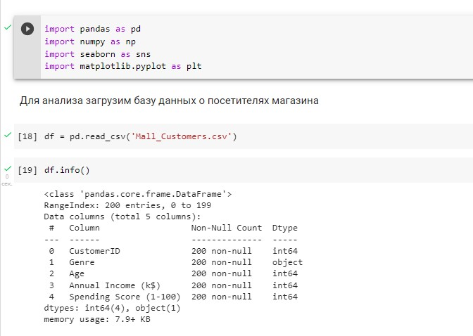
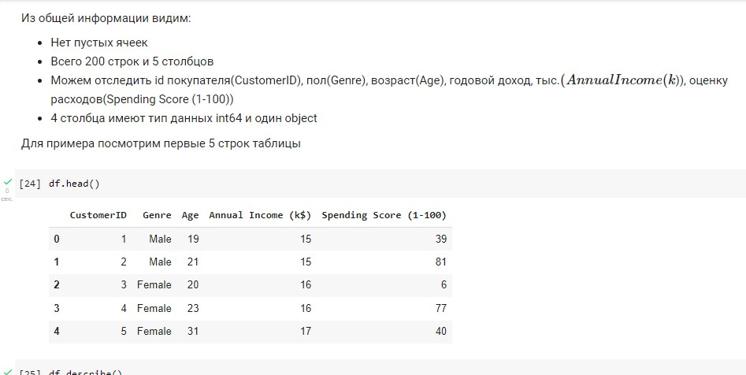
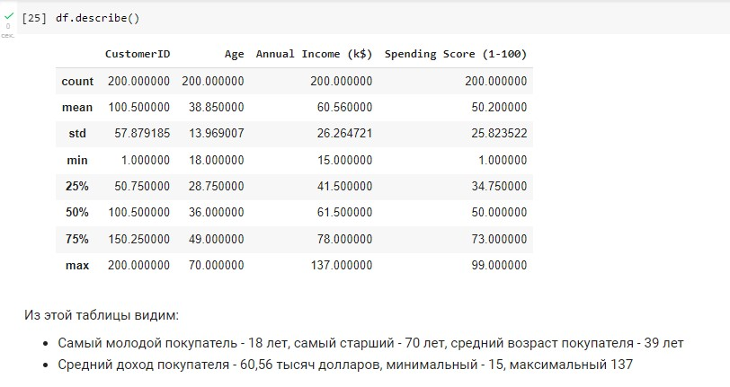
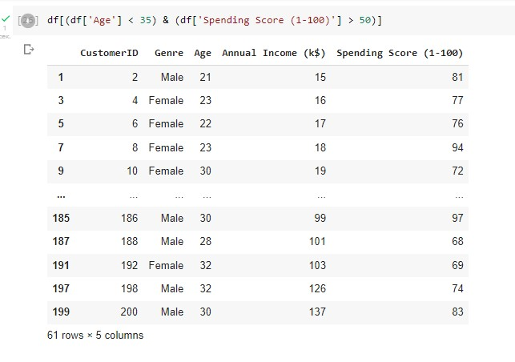
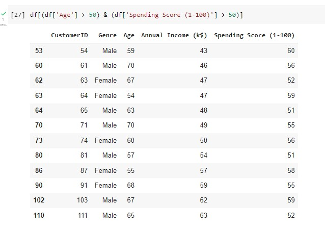
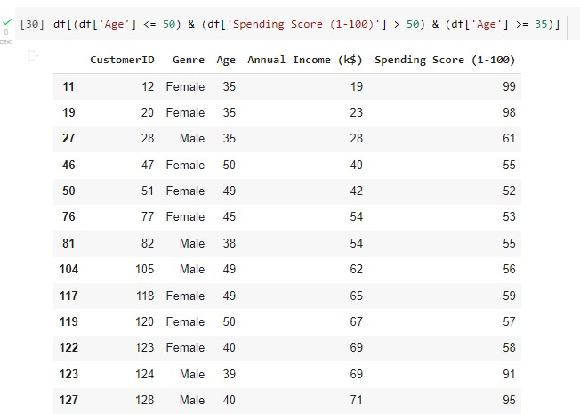
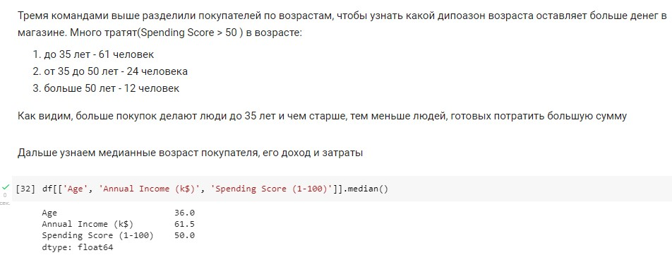
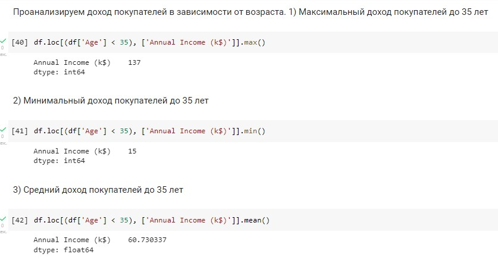
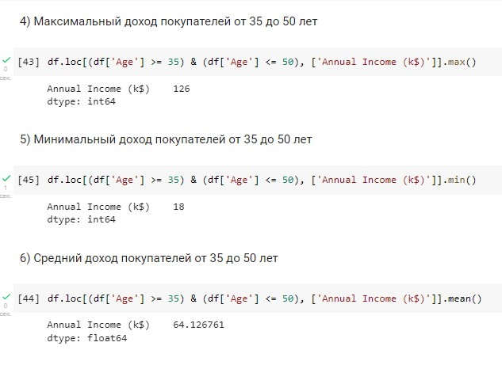
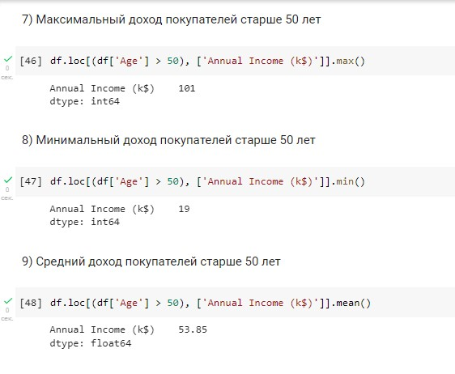
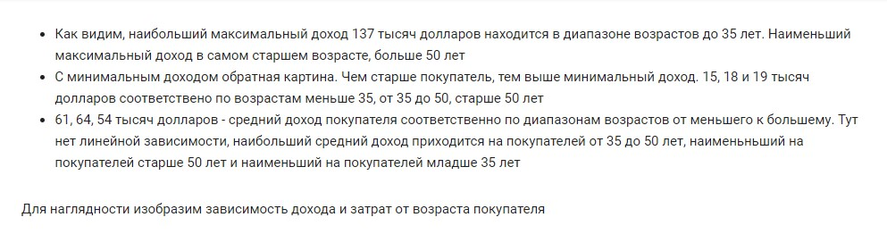
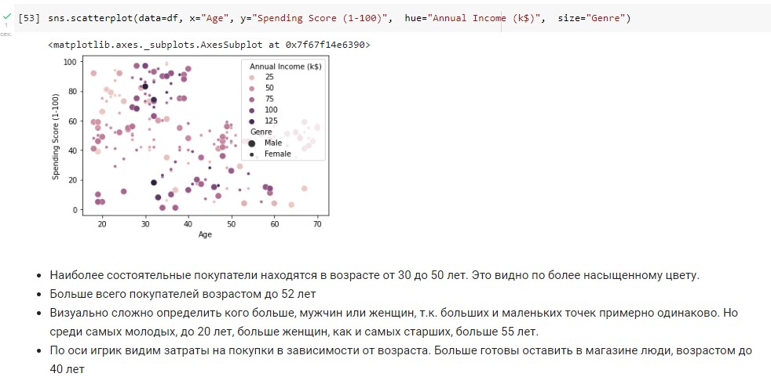